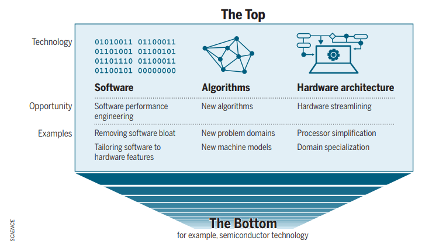

## What causes false sharing

## There’s plenty of room at the Top: What

will drive computer performance after Moore’s law?
The figure shows that now that **Moore’s law is ending**,
future performance improvements will no longer come mainly from better semiconductor technology (“the Bottom”).
Instead, they will come from the **Top** of the computing stack  **software**, **algorithms**,
and **hardware architecture**  where there is still huge room for optimization. The idea is th
at improvements such as removing software bloat, designing better algorithms, and using specialized
hardware will drive progress much more than transistor scaling.
